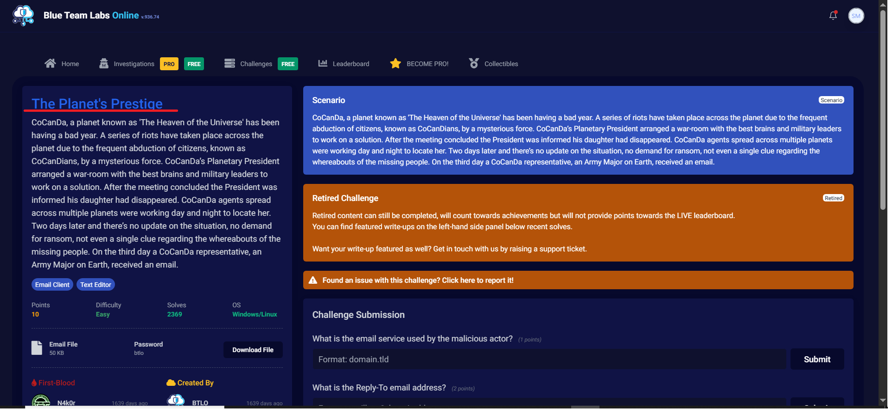
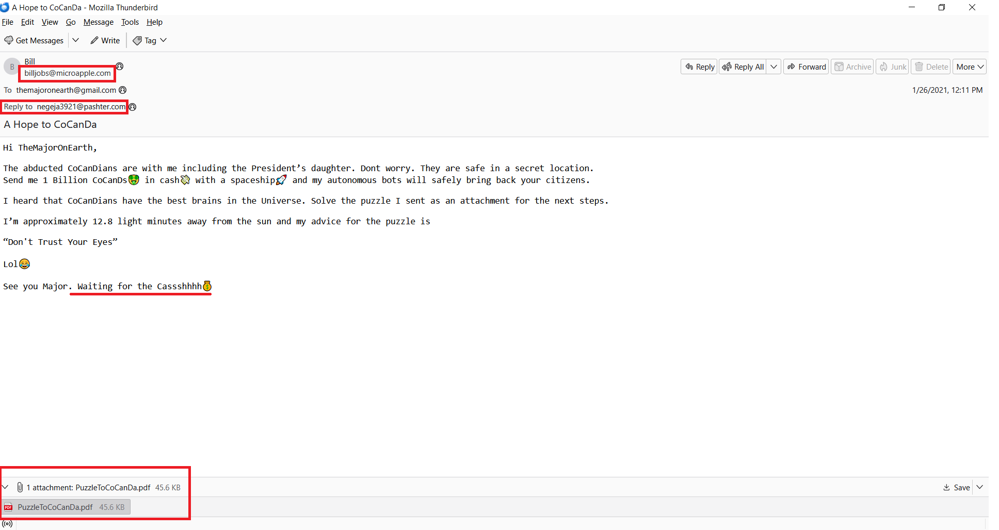
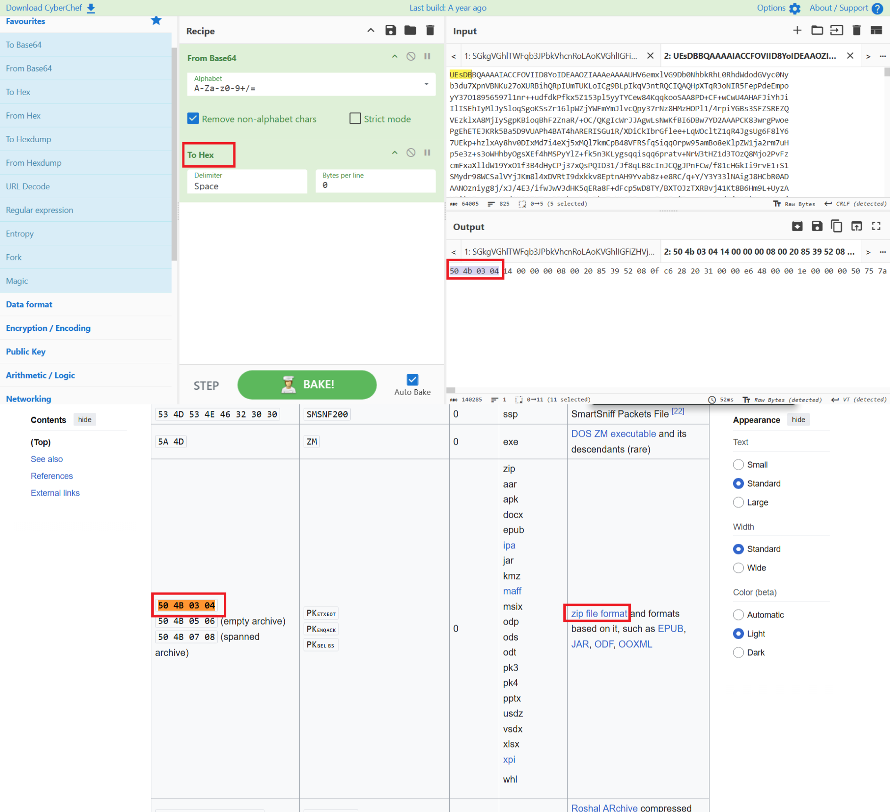
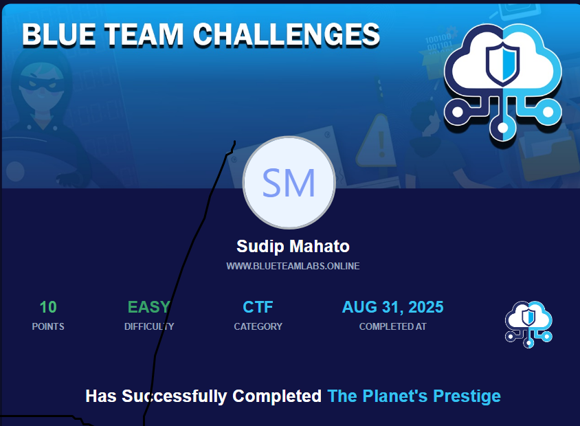

  # 🛡️ Phishing Email Analysis Project  

This repository contains my **Phishing Email Analysis** project, completed in the **Blue Team Labs Online** environment.  
The objective of this project is to **analyze a suspicious email**, investigate its attachments, and identify indicators of a phishing attempt.  

---

## 📑 Table of Contents
1. [Project Overview](#-project-overview)
2. [Email Sample](#-email-sample)
3. [Tools Used](#-tools-used)  
4. [Analysis Steps](#-analysis-steps)  
   - [Email Header Analysis](#1-email-header-analysis)  
   - [Email Body Investigation](#2-email-body-investigation)  
   - [Attachment Analysis](#3-attachment-analysis)  
4. [Key Findings](#-key-findings)  
5. [Q&A Section ](#-q&a-section )  
6. [Acknowledgment](#-acknowledgment)  
7. [Conclusion](#-conclusion)  
8. [License](#-licenset)

---
   ## 🚀 Project Overview  
Phishing emails are one of the most common attack vectors used by threat actors.  
In this project, I performed **forensic analysis** of a real-world style phishing email using different tools and techniques.  
 ---
  ## 📧 Email Sample
  - **File:** [`A Hope to CoCanDa.eml`](https://github.com/sudcyberip/phishing-email-analysis/blob/728aac1d5b66999d7075182095eb44cc20458dd4/A%20Hope%20to%20CoCanDa.eml)
  - To: themajoronearth@gmail.com
  - Subject: A Hope to CoCanDa
  - From: "Bill" <billjobs@microapple.com>
  - Reply-To: negeja3921@pashter.com
  - Date: Tue, 26 Jan 2021 01:41:18 -0500 (EST)

---

## 🔧 Tools Used  
- 🧩 **CyberChef** → for decoding and analyzing encoded strings  
- 🖼️ **ExifTool** → for extracting metadata from attachments  
- 📑 **GCK’s File Signatures Table** → to verify file signatures & magic numbers  
- 📝 **Notepad++** → for analyzing raw email headers and content  
- 🛠️ **HxD** → for hexadecimal file inspection  

---

## 🕵️‍♂️ Analysis Steps  

1. **Email Header Analysis**  
   - Compared **Sender** and **Reply-To** addresses → found mismatch  
   - Identified **SPF failure** in authentication results
     
      
    ---
2. **Email Body Investigation**  
   - Found **demand for money** and suspicious content
      
     
     
   - Detected attachment disguised as a **PDF file** but actually a **ZIP archive**
       - This is the attachment pretending  pdf file with email
         [📄 View  (PDF)](pretending-to-be-attached-pdf_file/PuzzleToCoCanDa.pdf)
       - Check the file signature number  of pdf file and getting the   signature number  of zip file
          
      ---
 3. **Attachment Analysis**  

    -The suspicious ZIP file contained **three files**. Their analysis is summarized below:

    | File Name     | Observed Content / Behavior | Suspicious Indicators |
    |---------------|-----------------------------|------------------------|
    | `GoodJobMajor.pdf` | Embedded message about **kidnapping people** and demand for **1 billion** ransom.. | Fake extension, used as a lure. |
    | `DaughtersCrown.jpeg`   | Contained a picture of a **crown**;  | Fake extension , strong phishing indicator. |
    | `Money.xlsx`   | Showed **suspicious hidden content** and irregular metadata. | Possible malware delivery vector or data exfiltration attempt. |
     ---
     -All three Suspicious file Below   
   
    
     ---
     [📄 View GoodJobMajor.pdf ](inside_attached_zip_file/GoodJobMajor.pdf)      |         [📄 Downlod Money.xlsx](inside_attached_zip_file/Money.xlsx)
   

 ✅ Based on the above, all three files are **malicious artifacts** confirming the phishing nature of the email.
 

---

## 🚩 Key Findings  
- ❌ **Sender and Reply-To mismatch**  
- ❌ **SPF validation failed**  
- ⚠️ **Suspicious demand for money**  
- ⚠️ **Attachment disguised as PDF → actually ZIP**  
- ⚠️ **Malicious files hidden inside ZIP (PDF, JPG, XLX)**
 ---

 ## ❓ Q&A Section  (BTLO)

| Question | Answer |
|----------|--------|
| **What is the email service used by the malicious actor?** | Emkei.cz |
| **What is the Reply-To email address?** | negeja3921@pashter.com |
| **What is the filetype of the received attachment which helped to continue the investigation?** | .zip |
| **What is the name of the malicious actor?** | Pestero Negeja |
| **What is the location of the attacker in this Universe?** | The Martian Colony, Beside Interplanetary Spaceport |
| **What could be the probable C&C domain to control the attacker’s autonomous bots?** | pashter.com |
---

---

## 🙌 Acknowledgment  

- Special thanks to **[Blue Team Labs Online](https://blueteamlabs.online/)** for providing the lab environment and phishing investigation scenario.  
- Tools like **CyberChef, ExifTool, GCK’s File Signature Table, Notepad++, and HxD** were instrumental in conducting this analysis.  
- Inspired by real-world **email forensics and SOC (Security Operations Center) analysis workflows**.
 
---
## 🧾 Conclusion

  👉 This investigation highlights the importance of **email security awareness**, **blue team defensive skills**, and the use of proper tools for identifying phishing attempts before they can cause damage.  

---
 ---
## 📄 **License**

 This project is released under the [MIT License](LICENSE).
---

> **Created by Sudip Mahato**

