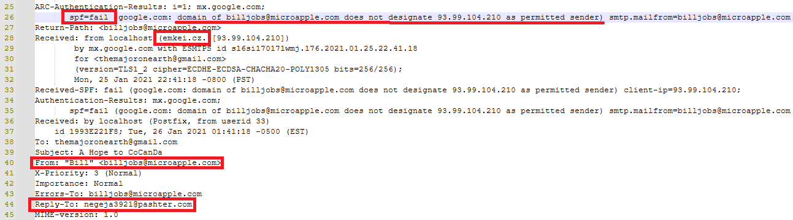

# 🛡️ Phishing Email Analysis Project  

This repository contains my **Phishing Email Analysis** project, completed in the **Blue Team Labs Online** environment.  
The objective of this project is to **analyze a suspicious email**, investigate its attachments, and identify indicators of a phishing attempt.  

---

## 📑 Table of Contents
1. [Project Overview](#-project-overview)  
2. [Tools Used](#-tools-used)  
3. [Analysis Steps](#-analysis-steps)  
   - [Email Header Analysis](#1-email-header-analysis)  
   - [Email Body Investigation](#2-email-body-investigation)  
   - [Attachment Analysis](#3-attachment-analysis)  
4. [Key Findings](#-key-findings)  
5. [Screenshots](#-screenshots)  
6. [Repository Structure](#-repository-structure)  
7. [Conclusion](#-conclusion)  
8. [Acknowledgment](#-acknowledgment)

---
   ## 🚀 Project Overview  
Phishing emails are one of the most common attack vectors used by threat actors.  
In this project, I performed **forensic analysis** of a real-world style phishing email using different tools and techniques.  

---

## 🔧 Tools Used  
- 🧩 **CyberChef** → for decoding and analyzing encoded strings  
- 🖼️ **ExifTool** → for extracting metadata from attachments  
- 📑 **GCK’s File Signatures Table** → to verify file signatures & magic numbers  
- 📝 **Notepad++** → for analyzing raw email headers and content  
- 🛠️ **HxD** → for hexadecimal file inspection  

---

## 🕵️‍♂️ Analysis Steps  

1. **Email Header Analysis**  
   - Compared **Sender** and **Reply-To** addresses → found mismatch  
   - Identified **SPF failure** in authentication results
     
      
    ---
2. **Email Body Investigation**  
   - Found **demand for money** and suspicious content
      
     
     
   - Detected attachment disguised as a **PDF file** but actually a **ZIP archive**

      
      

3. **Attachment Analysis**  
   - Extracted contents of the ZIP file  
   - Found 3 files:  
     - `document.pdf`  
     - `image.jpg`  
     - `data.xlx`  
   - All files contained **indicators of phishing/malware activity**  

---

